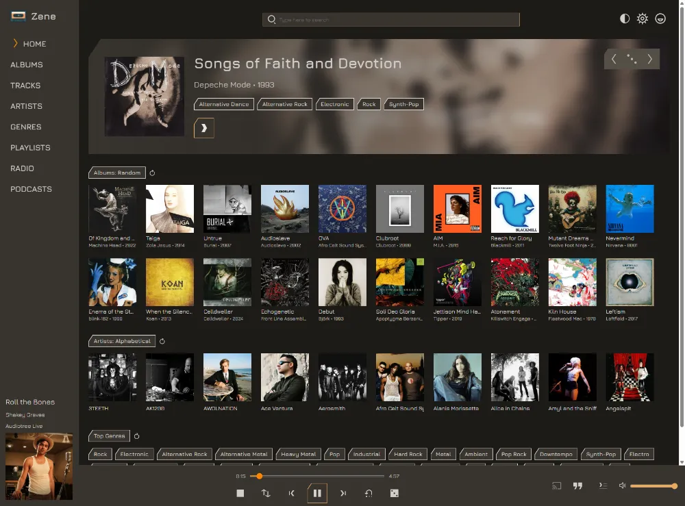

<!-- GitHub Actions SAST badge -->
[](https://github.com/uvmain/zene/actions/workflows/sast.yml)

<!-- Dependency Scanning badge -->
[](https://github.com/uvmain/zene/actions/workflows/dependency-scan.yml)

# Zene


## Self hosted Music Server and Web player
### Fast and feature packed with smart caching
- All transcoded audio is cached locally and cleaned with smart rules
- Wide support of If-Modified-Since headers for 304 responses
- Support for Accept-Encoding headers and gzip compression
- ffmpeg and ffprobe automatically downloaded as required on first boot
- Lyrics automatically fetched on demand from https://lrclib.net and saved locally
- Album art automatically fetched from album folder || embedded in track || https://api.deezer.com || coverartarchive.org
- Artist art automatically fetched from artist folder || [deezer](https://api.deezer.com) || wikidata
- Similar artists/songs are fetched from https://api.deezer.com and saved locally

### Uses the OpenSubsonic API
Supports the following OpenSubsonic API extensions:
- `apiKeyAuthentication` (this project supports password, enc:password, salt & token, and ApiKey auth)
- `formPost` (all endpoints support GET and POST, with either formData values OR query parameters)
- `songLyrics` (lyrics are pulled from lrclib on request, and saved locally in the database for future calls)
- `transcodeOffset` (supports streaming from an offset)
- `indexBasedQueue` (enables savePlayQueueByIndex and getPlayQueueByIndex endpoints)

### Supports the following OpenSubsonic API endpoints:

[Implemented OpenSubsonic API endpoints](./docs/implemented-opensubsonic-endpoints.md)

### Additional custom API endpoints include:
- `createAvatar` Accepts a `username` parameter and a `avatar` formFile key. Only admins can create avatars for other users.
- `updateAvatar` Accepts a `username` parameter and a `avatar` formFile key. Only admins can update avatars for other users.
- `deleteAvatar` Accepts a `username` parameter. Only admins can delete avatars for other users.
- `createApiKey` Accepts a `userId` parameter. Only admins can create API keys for other users.
- `getApiKeys` Accepts a `userId` parameter. Only admins can get API keys for other users.
- `deleteApiKey` Requires one or more `id` parameter(s). Accepts a `userId` parameter. Only admins can delete API keys for other users.

## Installation
- create a `.env` file using `.env.example` as a guide
- copy the `docker-compose.yml` file into the same directory, and update the mount points as required
- `docker compose up -d` to pull the image and run the container in the background

### Tech stack
- `Sqlite` database
- `Go` backend
- `Vue` frontend (embedded during build)

- uses `Air` and `Vite` for HMR, and `Caddy` for SSL in local development

## localdev
### requirements
- Go v1.24+
- Node 22+

### install dependencies
First install npm dependencies (this will install the frontend workspace and the Caddy localdev utility)
```bash
npm i
```
Then install the Golang requirements
```bash
npm run setup
```

resolving Caddy cert issues on debian/ubuntu
- Ensure libnss3-tools is installed
  ```bash
  sudo apt install libnss3-tools
  ```
- Enable port-binding for the caddy binary
  ```bash
  sudo setcap CAP_NET_BIND_SERVICE=+eip node_modules/caddy-baron/caddy
  ```
- If you still get an ERR_CERT_AUTHORITY_INVALID error, run:
  ```bash
  certutil -d sql:$HOME/.pki/nssdb -A -t "C,," -n "Caddy Local Authority" -i ~/.local/share/caddy/pki/authorities/local/root.crt
  ```

## TODO
- [x] limit user requests to configured music folder IDs
- [x] use User.MaxBitRate to limit bitrate // done for /stream, will need to implement it when I do /hls
- [ ] define an enum for allowed maxBitRate values to use in handlers
- [ ] enable future database migrations
- [x] getScanStatus and startScan handlers exist but need implementing
- [x] HandleGetCoverArt and HandleGetArtistArt needs to handle size int param and resize if requested
- [x] also use size parameter in unauthenticated HandleGetShareImg handler
- [ ] Enable last.fm integration for notes/lastFmUrl in getAlbumInfo.view
- [x] Create scan-populated table for SelectDistinctGenres query as it is slow (150ms here, 9ms in Navidrome) // done, it's now 3ms
- [ ] When a music dir is removed from .env, remove it from the DB
- [ ] fix mutex and cache check for GetMetadataForMusicBrainzAlbumId
- [ ] getArtistInfo with includeNotPresent=true should also fetch artist image links from Deezer
- [ ] getArtistInfo should fetch biography if user sets lastfm creds
- [ ] add Handler level caching for getTopSongs, GetArtistInfo
- [ ] fix getArtistInfo not working with feishin
- [ ] fetch artist art for album artists
