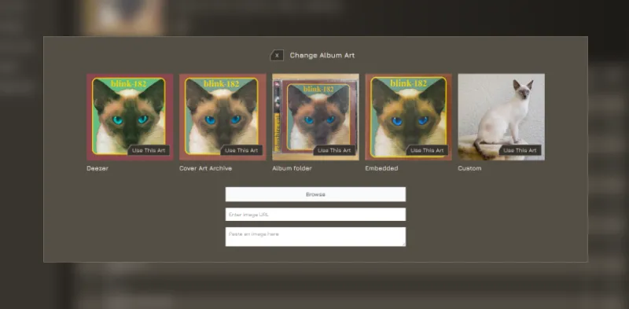

[](https://github.com/uvmain/zene/actions/workflows/sast.yml)
&nbsp;
[](https://github.com/uvmain/zene/actions/workflows/dependency-scan.yml)
&nbsp;
[](https://github.com/uvmain/zene/actions/workflows/build.yml)
&nbsp;

&nbsp;


# Zene


## Self hosted Music Server and Web player
### Fast, small and feature packed with smart caching
- No rocket emojis - just good old optimisation
- Light and Dark mode
- All transcoded audio is cached locally and cleaned with smart rules
- Wide support of If-Modified-Since headers for 304 responses
- Supports brotli and gzip compression
- ffmpeg and ffprobe automatically downloaded as required on first boot
- Lyrics automatically fetched on demand from https://lrclib.net and saved locally
- Album art automatically fetched from album folder || embedded in track || https://api.deezer.com || coverartarchive.org
- Artist art automatically fetched from artist folder || [deezer](https://api.deezer.com) || wikidata
- Similar artists/songs are fetched from https://api.deezer.com and saved locally
- Full podcast support, including downloading and offline playing
- Admins can update album art via frontend



### Uses the OpenSubsonic API
Supports the following OpenSubsonic API extensions:
- `apiKeyAuthentication` this project supports password, enc:password, salt & token, and ApiKey auth
- `formPost` all endpoints support GET and POST, with either formData values OR query parameters
- `songLyrics` lyrics are pulled from lrclib on request, and saved locally in the database for future calls
- `transcodeOffset` supports streaming from an offset
- `indexBasedQueue` enables savePlayQueueByIndex and getPlayQueueByIndex endpoints
- `getPodcastEpisode` enables the getPodcastEpisode endpoint

### Supports (and extends) the following OpenSubsonic API endpoints:

[Implemented OpenSubsonic API endpoints](./docs/implemented-opensubsonic-endpoints.md)

### Additional custom API endpoints include:
- `createAvatar` Accepts a `username` parameter and a `avatar` formFile key. Only admins can create avatars for other users.
- `updateAvatar` Accepts a `username` parameter and a `avatar` formFile key. Only admins can update avatars for other users.
- `deleteAvatar` Accepts a `username` parameter. Only admins can delete avatars for other users.
- `createApiKey` Accepts a `userId` parameter. Only admins can create API keys for other users.
- `getApiKeys` Accepts a `userId` parameter. Only admins can get API keys for other users.
- `deleteApiKey` Requires one or more `id` parameter(s). Accepts a `userId` parameter. Only admins can delete API keys for other users.
- `getAlbumArts` Returns URLs for various album art choices, eg Deezer, CoverArtArchive, Local Folder art, Embedded track art.
- `getAlbumArtsSse` Returns URLs via ServerSentEvents for various album art choices, eg Deezer, CoverArtArchive, Local Folder art, Embedded track art.
- `updateAlbumArt` Accepts an `id` parameter and a `file` form blob to update album art. Only admins can call this endpoint.
- `getArtistList` Like getAlbumList, requires `type` param which can be: `starred`, `random`, `newest`, `highest`, `frequent`, `recent` or `alphabetical`. If type=random, accepts an optional `seed` param (integer) to get deterministic results.
- `refreshPodcast` Like refreshPodcasts, but for a single channel. Requires an `id` parameter.

## Versioning
This project uses a [calver](https://calver.org/) versioning system like `pip`

`YY.MINOR.MICRO`

## Tagging guidelines
Zene *requires* MusicBrainz ID tags for artist, album and track. It does not infer these from filenames or directory structure, and will fail to import any music files that do not have each of these tags set.

These tags are already set by Lidarr. Alternatively, you can use a program like `beets` or `MusicBrainz Picard` to automatically assign these tags.

## Installation
- create a `.env` file using `.env.example` as a guide
- copy the `docker-compose.yml` file into the same directory, and update the mount points as required
- `docker compose up -d` to pull the image and run the container in the background

### example
> .env
```
BASE_URL=https://zene.domain.tld
ADMIN_USERNAME=admin
ADMIN_PASSWORD=supersecretpassword
ADMIN_EMAIL=admin@localhost
AUDIO_CACHE_MAX_DAYS=30
AUDIO_CACHE_MAX_MB=500
```
> docker-compose.yml
```
services:
  zene:
    image: uvmain/zene:latest
    container_name: zene
    env_file:
      - .env
    volumes:
      - ./local-data-dir:/data
      - /mnt/Music:/music:ro
    ports:
      - 3020:8080
```

### Tech stack
- `Sqlite` database
- `Go` backend
- `Vue` frontend (embedded during build)

- uses `Air` and `Vite` for HMR, and `Caddy` for SSL in local development

## localdev
### requirements
- Go v1.25+
- Node 22+

### install dependencies
First install npm dependencies (this will install the frontend workspace and the Caddy localdev utility)
```bash
npm i
```
Then install the Golang requirements
```bash
npm run setup
```

resolving Caddy cert issues on debian/ubuntu
- Ensure libnss3-tools is installed
  ```bash
  sudo apt install libnss3-tools
  ```
- Enable port-binding for the caddy binary
  ```bash
  sudo setcap CAP_NET_BIND_SERVICE=+eip node_modules/caddy-baron/caddy
  ```
- If you still get an ERR_CERT_AUTHORITY_INVALID error, run:
  ```bash
  certutil -d sql:$HOME/.pki/nssdb -A -t "C,," -n "Caddy Local Authority" -i ~/.local/share/caddy/pki/authorities/local/root.crt
  ```